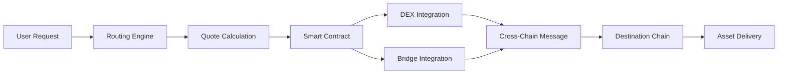

# The Project - USDT Core Cross-Chain Router

**Version:** 1.0  
**Status:** Part 4 Quality Assurance Complete ✅  
**License:** MIT  
**Focus:** USDT cross-chain infrastructure foundation

A production-ready USDT cross-chain routing platform with zero cognitive load
user experience, complete transparency, and mobile-first PWA design.

## 🌟 Overview

The USDT Core repository provides a rock-solid foundation for cross-chain USDT
operations. This implementation focuses on delivering a world-class user
experience with sub-200ms quote times, complete transparency, and
mobile-optimized PWA features.

### ✅ Completed Features (Parts 1-4)

**Quality Assurance Infrastructure (Part 4):**

- **🔍 Code Quality Tools**: ESLint + TypeScript, Prettier with Solidity
  support, Husky pre-commit hooks
- **🧪 Testing Infrastructure**: Unit tests (27+ passing), integration tests,
  E2E with Playwright
- **📚 Documentation Standards**: JSDoc/TSDoc (65+ blocks), Swagger API docs,
  contract docs, dev/deployment guides
- **🛡️ Automated Reviews**: Pre-commit validation, code quality gates,
  comprehensive test coverage

**Backend Infrastructure (Part 3):**

- **🔗 USDT Routing Engine**: High-performance pathfinding optimized for USDT
  operations
- **⚡ Sub-200ms Quotes**: Redis + in-memory caching for instant price feeds
- **🗄️ Database Architecture**: TypeORM with PostgreSQL and comprehensive
  migrations
- **🛡️ Production-Ready API**: Express server with comprehensive middleware
  stack

**User Experience Excellence:**

- **🧠 Zero Cognitive Load**: Simplified interface requiring minimal mental
  effort
- **🔄 "It Just Works"**: Self-healing components with graceful degradation
- **📊 Radical Transparency**: Complete visibility into fees, progress, and
  operations
- **⚡ Speed as Feature**: Performance monitoring with real-time metrics
- **📱 Mobile-First PWA**: Touch-optimized with native-like interactions

---

## 🎭 Department Review Program

**For Non-Technical Department Reviews**: Starting from Part 1.5, the dapp
includes a comprehensive review program that allows other departments to easily
evaluate our progress.

### ⚡ Quick Review Setup (3 minutes)

```bash
# One-command setup for department reviews
./scripts/setup-review.sh

# Start the review environment
npm run review:start

# Open browser to http://localhost:3000
```

### 🐳 Docker Alternative (Even Easier)

```bash
# One-command deployment
docker-compose -f docker-compose.review.yml up

# Access at http://localhost:3000
```

### 📋 What Reviewers Will See

- **Professional Interface**: Production-ready fintech-grade design
- **Demo Environment**: Pre-loaded with realistic sample data
- **Guided Tour**: Built-in explanations and feature highlights
- **Mobile Testing**: Responsive design across all devices
- **Performance Metrics**: Real-time performance and usability data

### 🎯 Review Focus Areas

#### For Marketing Department

- Brand consistency and professional appearance
- User appeal and conversion potential
- Mobile experience quality

#### For Legal/Compliance

- Professional appearance building user trust
- Clear transaction flows and fee transparency
- Security indicators and user confidence factors

#### For Business Teams

- User experience quality and intuitive navigation
- Feature completeness and business viability
- Performance and reliability demonstration

### 📚 Review Documentation

- `REVIEW_README.md` - Quick start for department reviewers
- `review-docs/REVIEW_GUIDE.md` - Comprehensive review instructions
- `review-docs/TROUBLESHOOTING.md` - Common issues and solutions

### 💡 Key Benefits

- **No Technical Setup**: One-command deployment
- **Safe Demo Mode**: No real cryptocurrency needed
- **Realistic Experience**: Production-quality interface with sample data
- **Cross-Platform**: Works on Windows, macOS, and Linux
- **Mobile Ready**: Test on any device or browser resize

---

## 📁 Project Structure

```
the-project/
├── packages/
│   ├── frontend/              # React DApp interface
│   ├── contracts/             # Smart contracts (Solidity)
│   ├── routing-engine/        # Off-chain routing service
│   ├── shared/               # Shared types and utilities
│   └── api/                  # Backend API services
├── docs/                     # Documentation
├── scripts/                  # Deployment and utility scripts
└── tests/                    # Integration tests
```

### Package Overview

- **`packages/frontend/`**: React-based user interface with wallet integration
- **`packages/contracts/`**: Solidity smart contracts for cross-chain execution
- **`packages/routing-engine/`**: Core pathfinding and optimization algorithms
- **`packages/shared/`**: Common types, utilities, and constants
- **`packages/api/`**: REST API and WebSocket services

## 💡 How It Works

### User Flow Example: ETH → SOL

1. **User Input**: Select ETH on Ethereum and SOL on Solana
2. **Route Discovery**: Engine finds optimal path (ETH → USDC → Bridge → SOL)
3. **Quote Generation**: Calculate exact output and total fees
4. **One-Click Execution**: User signs single transaction
5. **Automated Execution**: System handles all intermediate steps
6. **Asset Delivery**: SOL arrives in user's Solana wallet

### Technical Flow



## 🔧 Development

### Smart Contracts

```bash
# Compile contracts
cd packages/contracts
npx hardhat compile

# Run contract tests
npx hardhat test

# Deploy to local network
npx hardhat run scripts/deploy.ts --network localhost
```

### Frontend Development

```bash
# Start frontend development server
cd packages/frontend
yarn dev

# Build for production
yarn build

# Run component tests
yarn test
```

### Backend Services

```bash
# Start routing engine
cd packages/routing-engine
yarn dev

# Start API server
cd packages/api
yarn dev

# Run integration tests
yarn test:integration
```

## 🧪 Testing

### Test Categories

- **Unit Tests**: Individual component testing
- **Integration Tests**: Cross-package functionality
- **E2E Tests**: Full user journey simulation
- **Contract Tests**: Smart contract security and functionality

### Running Tests

```bash
# Run all tests
yarn test

# Run specific test suites
yarn test:contracts
yarn test:frontend
yarn test:integration
yarn test:e2e

# Run tests with coverage
yarn test:coverage
```

## 📊 Monitoring & Analytics

### Metrics Tracked

- **Performance**: Quote response times, execution success rates
- **Usage**: Transaction volume, unique users, popular routes
- **Network Health**: Node distribution, stake participation (V2)
- **Security**: Failed transactions, unusual patterns

### Development Metrics

- **Quote Response Time**: < 1 second target
- **Route Accuracy**: > 99% successful execution rate
- **Gas Efficiency**: < 5% overhead vs direct usage
- **Uptime**: > 99.9% system availability

## 🔐 Security

### Smart Contract Security

- **Multi-layered Audits**: Independent security reviews
- **Formal Verification**: Mathematical proof of critical properties
- **Bug Bounty Program**: Ongoing vulnerability discovery incentives
- **Gradual Rollout**: Tiered deployment with value limits

### Operational Security

- **Non-Custodial**: Users maintain control of private keys
- **Access Controls**: Multi-signature requirements for admin functions
- **Monitoring**: Real-time anomaly detection
- **Emergency Procedures**: Circuit breakers and pause mechanisms

## 🗺️ Roadmap

### Q4 2024 - Q1 2025: V1 Launch

- [ ] Core smart contracts deployment
- [ ] Routing engine optimization
- [ ] Frontend DApp release
- [ ] ETH ↔ SOL support
- [ ] Security audits completion

### Q2 2025 - Q3 2025: V1 Expansion

- [ ] Additional chain support (Polygon, Avalanche)
- [ ] Advanced features (MEV protection, gas optimization)
- [ ] Mobile application
- [ ] Performance optimizations

### Q4 2025+: V2 Decentralization

- [ ] Pathfinder Network testnet
- [ ] Staking and governance implementation
- [ ] Gradual migration to V2
- [ ] Full decentralization

## 📚 Documentation

- **[Technical Paper](../technical_paper.md)**: Comprehensive system design
- **[API Documentation](./docs/api/)**: REST API and WebSocket references
- **[Smart Contracts](./docs/contracts/)**: Contract documentation and ABIs
- **[Architecture](./docs/architecture/)**: System design and diagrams
- **[Deployment Guide](./docs/deployment/)**: Production deployment instructions

## 🤝 Contributing

We welcome contributions from the community! Please see our
[Contributing Guide](./CONTRIBUTING.md) for details.

### Development Setup

1. Fork the repository
2. Create a feature branch
3. Set up local development environment
4. Make your changes
5. Run tests and ensure they pass
6. Submit a pull request

### Code Standards

- **TypeScript**: Strict type checking enabled
- **ESLint**: Code linting and formatting
- **Prettier**: Code style consistency
- **Conventional Commits**: Standardized commit messages

## 📄 License

This project is licensed under the MIT License - see the [LICENSE](./LICENSE)
file for details.

## 🆘 Support

### Community

- **Discord**: [Join our community](https://discord.gg/theproject)
- **Twitter**: [@TheProjectDeFi](https://twitter.com/TheProjectDeFi)
- **GitHub Issues**:
  [Report bugs or request features](https://github.com/theproject/issues)

### Documentation

- **User Guide**: How to use the DApp
- **Developer Docs**: Technical implementation details
- **FAQ**: Common questions and troubleshooting

### Getting Help

1. Check the [FAQ](./docs/FAQ.md) for common issues
2. Search [existing issues](https://github.com/theproject/issues)
3. Join our [Discord](https://discord.gg/theproject) for community support
4. Create a new issue for bug reports or feature requests

---

**⚠️ Disclaimer**: This software is in active development. Use at your own risk.
Always verify transactions and never risk more than you can afford to lose.

**🔗 Links**

- [Website](https://theproject.xyz)
- [Documentation](https://docs.theproject.xyz)
- [GitHub](https://github.com/theproject)
- [Twitter](https://twitter.com/TheProjectDeFi)
