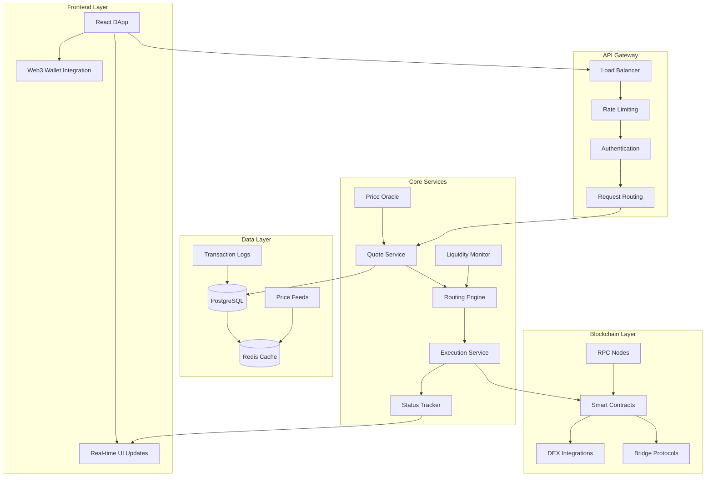

# System Architecture

The Project employs a microservices architecture designed for scalability,
reliability, and maintainability. Our system prioritizes stablecoin operations
while maintaining flexibility for future expansion.

## High-Level Architecture



## Component Overview

### Frontend Layer

- **React DApp**: Modern React 18 + TypeScript interface
- **Wallet Integration**: MetaMask, WalletConnect, Phantom support
- **Real-time Updates**: WebSocket connections for live data
- **Responsive Design**: Mobile-first, cross-device compatibility

### API Gateway

- **Load Balancing**: Distribute traffic across service instances
- **Rate Limiting**: Protect against abuse and ensure fair usage
- **Authentication**: API key and JWT-based authentication
- **Request Routing**: Intelligent routing to appropriate services

### Core Services

#### Quote Service

- **Price Aggregation**: Real-time price data from multiple sources
- **Slippage Calculation**: Dynamic slippage based on trade size
- **Gas Estimation**: Accurate gas cost prediction across chains
- **Quote Caching**: Intelligent caching for performance optimization

#### Routing Engine

- **Path Finding**: Optimal route discovery across chains and DEXs
- **Arbitrage Detection**: Real-time arbitrage opportunity identification
- **Liquidity Analysis**: Deep liquidity assessment for large trades
- **Multi-hop Optimization**: Complex routing with multiple intermediate steps

#### Execution Service

- **Transaction Building**: Construct optimized transaction payloads
- **Signature Validation**: Verify user signatures and permissions
- **MEV Protection**: Integration with MEV protection services
- **Retry Logic**: Intelligent retry mechanisms for failed transactions

#### Status Tracker

- **Real-time Monitoring**: Track transaction progress across chains
- **Event Processing**: Process blockchain events and update status
- **Notification System**: Push notifications for status changes
- **Historical Data**: Maintain comprehensive transaction history

### Data Architecture

#### PostgreSQL Database

```sql
-- Core tables structure
CREATE TABLE transactions (
    id UUID PRIMARY KEY,
    user_address VARCHAR(42) NOT NULL,
    source_chain_id INTEGER NOT NULL,
    dest_chain_id INTEGER NOT NULL,
    token_in VARCHAR(42) NOT NULL,
    token_out VARCHAR(42) NOT NULL,
    amount_in NUMERIC(78,0) NOT NULL,
    amount_out NUMERIC(78,0),
    status VARCHAR(20) NOT NULL,
    created_at TIMESTAMP NOT NULL,
    updated_at TIMESTAMP NOT NULL
);

CREATE TABLE quotes (
    id UUID PRIMARY KEY,
    transaction_id UUID REFERENCES transactions(id),
    route JSONB NOT NULL,
    price_impact DECIMAL(10,6),
    gas_estimate NUMERIC(78,0),
    valid_until TIMESTAMP NOT NULL,
    created_at TIMESTAMP NOT NULL
);

CREATE TABLE price_feeds (
    id SERIAL PRIMARY KEY,
    token_address VARCHAR(42) NOT NULL,
    chain_id INTEGER NOT NULL,
    price DECIMAL(20,8) NOT NULL,
    source VARCHAR(50) NOT NULL,
    timestamp TIMESTAMP NOT NULL
);
```

#### Redis Cache Structure

```redis
# Price data caching
SET price:1:0xA0b86a33E6448193c3Cf4FB58E3E2e80e96C5B8B "1.0000" EX 10
SET price:42161:0xFF970A61A04b1cA14834A43f5dE4533eBDDB5CC8 "0.9998" EX 10

# Quote caching
SET quote:user123:hash456 '{"amountOut":"990000","route":[...],"gasEstimate":"150000"}' EX 30

# Rate limiting
INCR ratelimit:api:user123 EX 900
```

## Service Communication

### REST API

Primary communication between frontend and backend services:

```typescript
interface APIRequest {
  method: 'GET' | 'POST' | 'PUT' | 'DELETE';
  endpoint: string;
  headers: Record<string, string>;
  body?: any;
}

interface APIResponse<T> {
  success: boolean;
  data?: T;
  error?: {
    code: string;
    message: string;
    details?: any;
  };
  timestamp: string;
}
```

### WebSocket Communication

Real-time updates for price feeds and transaction status:

```typescript
interface WebSocketMessage {
  type: 'price_update' | 'transaction_update' | 'route_update';
  data: any;
  timestamp: string;
}

// Price update example
{
  type: 'price_update',
  data: {
    tokenAddress: '0xA0b86a33E6448193c3Cf4FB58E3E2e80e96C5B8B',
    chainId: 1,
    price: '1.0001',
    change24h: 0.0001
  },
  timestamp: '2025-07-01T12:00:00.000Z'
}
```

### Inter-Service Communication

Services communicate via HTTP APIs and message queues:

```typescript
// Service-to-service API call
const quote = await quoteService.getQuote({
  tokenIn: 'USDT',
  tokenOut: 'USDC',
  amountIn: '1000000',
  chainIdIn: 1,
  chainIdOut: 42161,
});

// Message queue for async processing
await messageQueue.publish('transaction.status.update', {
  transactionId: 'tx123',
  status: 'confirmed',
  blockNumber: 18500000,
});
```

## Scalability Design

### Horizontal Scaling

- **Stateless Services**: All services designed to be stateless
- **Load Balancing**: Round-robin and least-connections algorithms
- **Auto-scaling**: Kubernetes HPA based on CPU/memory metrics
- **Database Sharding**: Partition data by chain ID and date

### Performance Optimization

- **Connection Pooling**: Efficient database connection management
- **Query Optimization**: Indexed database queries and query planning
- **Caching Strategy**: Multi-layer caching (Redis, CDN, browser)
- **Async Processing**: Background processing for heavy operations

### Monitoring and Observability

#### Metrics Collection

```yaml
# Prometheus metrics examples
http_requests_total{method="POST", endpoint="/api/v1/quote", status="200"}
transaction_processing_duration_seconds{chain="ethereum", status="success"}
price_feed_latency_seconds{source="uniswap", token="USDT"}
```

#### Logging Strategy

```typescript
// Structured logging with correlation IDs
logger.info('Quote requested', {
  correlationId: 'req-123',
  userId: 'user-456',
  tokenIn: 'USDT',
  tokenOut: 'USDC',
  amountIn: '1000000',
  duration: 150,
});
```

#### Health Checks

```typescript
// Service health check endpoint
app.get('/health', async (req, res) => {
  const checks = await Promise.allSettled([
    checkDatabase(),
    checkRedis(),
    checkBlockchainRPC(),
    checkExternalAPIs(),
  ]);

  const healthy = checks.every(check => check.status === 'fulfilled');
  res.status(healthy ? 200 : 503).json({
    status: healthy ? 'healthy' : 'unhealthy',
    checks: checks.map(check => ({
      name: check.name,
      status: check.status,
      latency: check.latency,
    })),
    timestamp: new Date().toISOString(),
  });
});
```

## Security Architecture

### Authentication & Authorization

- **API Keys**: Rate-limited API access with usage tracking
- **JWT Tokens**: Short-lived tokens for authenticated sessions
- **Role-Based Access**: Different permission levels for various operations
- **IP Whitelisting**: Additional security for sensitive operations

### Data Protection

- **Encryption at Rest**: Database encryption using AES-256
- **Encryption in Transit**: TLS 1.3 for all external communications
- **PII Handling**: Minimal collection and secure handling of user data
- **Audit Logging**: Comprehensive audit trails for all operations

### Network Security

- **WAF Protection**: Web Application Firewall filtering
- **DDoS Protection**: Multi-layer DDoS mitigation
- **VPC Isolation**: Private network segmentation
- **Regular Penetration Testing**: Quarterly security assessments

## Deployment Architecture

### Infrastructure as Code

```yaml
# Kubernetes deployment example
apiVersion: apps/v1
kind: Deployment
metadata:
  name: quote-service
spec:
  replicas: 3
  selector:
    matchLabels:
      app: quote-service
  template:
    metadata:
      labels:
        app: quote-service
    spec:
      containers:
        - name: quote-service
          image: theproject/quote-service:latest
          ports:
            - containerPort: 3000
          env:
            - name: DATABASE_URL
              valueFrom:
                secretKeyRef:
                  name: database-secrets
                  key: url
          resources:
            requests:
              memory: '256Mi'
              cpu: '200m'
            limits:
              memory: '512Mi'
              cpu: '500m'
```

### CI/CD Pipeline

```yaml
# GitHub Actions workflow
name: Deploy to Production
on:
  push:
    branches: [main]

jobs:
  test:
    runs-on: ubuntu-latest
    steps:
      - uses: actions/checkout@v3
      - name: Run tests
        run: npm test
      - name: Run security scan
        run: npm audit

  build:
    needs: test
    runs-on: ubuntu-latest
    steps:
      - name: Build Docker images
        run: docker build -t theproject/api:${{ github.sha }} .
      - name: Push to registry
        run: docker push theproject/api:${{ github.sha }}

  deploy:
    needs: build
    runs-on: ubuntu-latest
    steps:
      - name: Deploy to Kubernetes
        run:
          kubectl set image deployment/api api=theproject/api:${{ github.sha }}
```

## Disaster Recovery

### Backup Strategy

- **Database Backups**: Daily automated backups with 30-day retention
- **Configuration Backups**: GitOps approach with version-controlled configs
- **Code Backups**: Multiple git repositories and registry mirrors
- **Cross-Region Replication**: Async replication to disaster recovery region

### Recovery Procedures

- **RTO (Recovery Time Objective)**: 15 minutes for critical services
- **RPO (Recovery Point Objective)**: 1 hour maximum data loss
- **Automated Failover**: Health check-based automatic failover
- **Manual Recovery**: Documented procedures for manual intervention

This architecture provides a robust foundation for The Project's
stablecoin-focused cross-chain routing system, ensuring scalability,
reliability, and security while maintaining the flexibility needed for future
enhancements.
