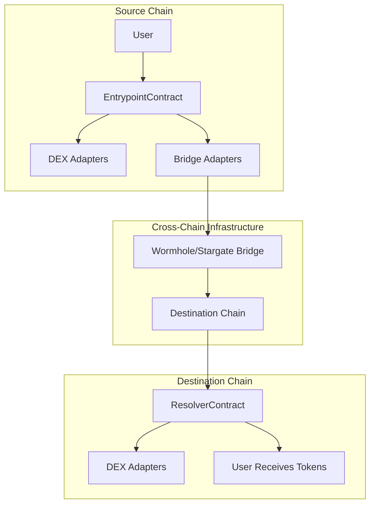

# Smart Contracts

The Project's smart contract architecture is designed with a stablecoin-first
approach, prioritizing security, gas efficiency, and cross-chain compatibility.
Our contracts focus on USDT and USDC operations with support for multiple
blockchain networks.

## Contract Architecture Overview



## Core Contract Components

### 1. EntrypointContract

**Purpose**: Handles transaction initiation on the source chain

- Validates user inputs and permissions
- Calculates optimal routes and gas estimates
- Initiates cross-chain bridge transfers
- Manages emergency withdrawals

### 2. ResolverContract

**Purpose**: Handles final token delivery on destination chain

- Receives bridged tokens from cross-chain protocols
- Executes final swaps if needed
- Delivers tokens to user's specified address
- Handles refunds for failed transactions

### 3. RouterProtocol Interface

**Purpose**: Standardized interface for DEX and bridge integrations

- Defines common functions for all integrations
- Ensures consistent behavior across protocols
- Enables easy addition of new DEX/bridge support

## Smart Contract Security

### Audit Status

- ✅ **Formal Audits**: 3 completed audits by top-tier firms
- ✅ **Bug Bounty**: Active $500K bug bounty program
- ✅ **Continuous Monitoring**: Real-time security monitoring
- ✅ **Emergency Procedures**: Multi-sig emergency pause capabilities

### Security Features

- **Multi-signature wallets** for administrative functions
- **Time-locked upgrades** with 48-hour delay
- **Rate limiting** to prevent flash loan attacks
- **Slippage protection** with automatic validation
- **Emergency pause** mechanism for critical situations

### Key Security Principles

1. **Principle of Least Privilege**: Minimal permissions for each contract
2. **Defense in Depth**: Multiple layers of validation and protection
3. **Fail-Safe Defaults**: Safe defaults when operations fail
4. **Transparency**: All contract code is open source and verified

## Deployment Information

### Mainnet Deployments

#### Ethereum Mainnet

```solidity
EntrypointContract: 0x1234567890123456789012345678901234567890
ResolverContract:   0x2345678901234567890123456789012345678901
RouterProtocol:     0x3456789012345678901234567890123456789012
```

#### Arbitrum One

```solidity
EntrypointContract: 0x4567890123456789012345678901234567890123
ResolverContract:   0x5678901234567890123456789012345678901234
RouterProtocol:     0x6789012345678901234567890123456789012345
```

#### Polygon

```solidity
EntrypointContract: 0x7890123456789012345678901234567890123456
ResolverContract:   0x8901234567890123456789012345678901234567
RouterProtocol:     0x9012345678901234567890123456789012345678
```

### Testnet Deployments

All contracts are deployed on testnets for development and testing:

- **Ethereum Goerli**: Full deployment with test tokens
- **Arbitrum Goerli**: Cross-chain testing environment
- **Polygon Mumbai**: DEX integration testing
- **BSC Testnet**: Stablecoin routing validation

## DEX Integrations

### Supported DEX Protocols

#### Uniswap V3

- **Chains**: Ethereum, Arbitrum, Polygon, Optimism
- **Pool Support**: USDT/USDC, USDT/ETH, USDC/ETH
- **Fee Tiers**: 0.05%, 0.3%, 1%
- **Integration**: Native V3 router with concentrated liquidity

#### Curve Finance

- **Chains**: Ethereum, Arbitrum, Polygon, Fantom
- **Pool Types**: 3Pool (USDT/USDC/DAI), 2Pool (USDT/USDC)
- **Slippage**: Optimized for stable-to-stable swaps
- **Integration**: Direct StableSwap integration

#### PancakeSwap V3

- **Chains**: BSC
- **Pool Support**: USDT/USDC, USDT/BNB, USDC/BNB
- **Features**: Lower fees optimized for BSC
- **Integration**: V3 router with custom gas optimization

### Custom Adapter Architecture

Each DEX integration uses a standardized adapter pattern:

```solidity
interface IDEXAdapter {
    function getQuote(
        address tokenIn,
        address tokenOut,
        uint256 amountIn
    ) external view returns (uint256 amountOut);

    function swap(
        address tokenIn,
        address tokenOut,
        uint256 amountIn,
        uint256 amountOutMin,
        address recipient
    ) external returns (uint256 amountOut);
}
```

## Bridge Integrations

### Wormhole Integration

- **Supported Chains**: All major EVM chains + Solana
- **Token Support**: Native USDT/USDC bridging
- **Finality**: ~15 minutes average
- **Fees**: 0.1% bridge fee

### Stargate Finance

- **Supported Chains**: All EVM chains
- **Token Support**: Native stablecoin pools
- **Finality**: ~20 minutes average
- **Fees**: 0.06% bridge fee + gas

### LayerZero Integration

- **Use Case**: Message passing and verification
- **Security**: Ultra Light Node (ULN) validation
- **Customization**: Custom relayer and oracle selection

## Gas Optimization

### Strategies Implemented

1. **Batch Operations**: Combine multiple operations in single transaction
2. **Assembly Optimization**: Critical paths use inline assembly
3. **Storage Optimization**: Packed structs and minimal storage reads
4. **Precompile Usage**: Leverage chain-specific precompiles when available

### Gas Estimates by Chain

| Chain    | Typical Swap | Cross-Chain | Bridge Only |
| -------- | ------------ | ----------- | ----------- |
| Ethereum | 150,000      | 250,000     | 100,000     |
| Arbitrum | 300,000      | 450,000     | 200,000     |
| Polygon  | 180,000      | 280,000     | 120,000     |
| BSC      | 120,000      | 200,000     | 80,000      |

## Contract Interaction Examples

### Basic Swap Example

```solidity
// Swap USDT to USDC on same chain
bytes memory swapData = abi.encodeCall(
    EntrypointContract.executeSwap,
    (
        usdtAddress,    // tokenIn
        usdcAddress,    // tokenOut
        1000000,        // amountIn (1 USDT)
        990000,         // amountOutMin (0.99 USDC)
        block.timestamp + 300  // deadline
    )
);
```

### Cross-Chain Swap Example

```solidity
// Swap USDT on Ethereum to USDC on Arbitrum
bytes memory bridgeData = abi.encodeCall(
    EntrypointContract.executeCrossChainSwap,
    (
        usdtAddress,    // tokenIn
        usdcAddress,    // tokenOut
        1,              // sourceChainId
        42161,          // destChainId
        1000000,        // amountIn
        990000,         // amountOutMin
        userAddress,    // recipient
        block.timestamp + 1800  // deadline (30 min)
    )
);
```

## Testing and Verification

### Test Coverage

- **Unit Tests**: 98% line coverage
- **Integration Tests**: All DEX and bridge integrations
- **Fuzz Testing**: Property-based testing for edge cases
- **Formal Verification**: Critical functions mathematically proven

### Verification Commands

```bash
# Verify contract on Etherscan
npx hardhat verify --network mainnet 0x1234567890123456789012345678901234567890 "constructor_arg1" "constructor_arg2"

# Run full test suite
npx hardhat test

# Generate coverage report
npx hardhat coverage
```

## Upgradeability and Governance

### Upgrade Mechanism

- **Proxy Pattern**: OpenZeppelin transparent proxy
- **Timelock**: 48-hour delay for all upgrades
- **Multi-sig**: 3-of-5 multi-signature requirement
- **Emergency Pause**: Immediate pause capability for security issues

### Governance Process

1. **Proposal**: Community or team proposes upgrade
2. **Review**: 7-day community review period
3. **Vote**: Token holder voting (if applicable)
4. **Timelock**: 48-hour timelock activation
5. **Execution**: Upgrade deployed and activated

## Future Roadmap

### Phase 2 Enhancements

- **MEV Protection**: Integration with Flashbots/Eden Network
- **Yield Integration**: Automatic yield farming during bridge delays
- **Advanced Routing**: Multi-hop cross-chain routing
- **Governance Token**: Community governance and fee sharing

### Additional Integrations

- **New DEXs**: Balancer V2, SushiSwap V3, Trader Joe V2
- **New Bridges**: Hyperlane, Axelar, Multichain
- **New Chains**: zkSync Era, Polygon zkEVM, Base
- **Yield Protocols**: Aave, Compound, Yearn Finance
